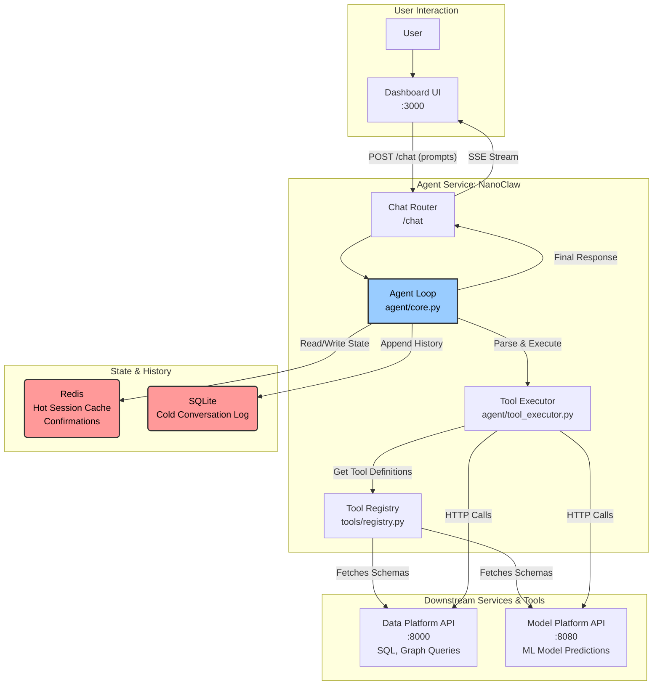

# NanoClaw Agent Infrastructure

```mermaid
graph TD
    subgraph UserInteraction [User Interaction]
        U[User] --> D[Dashboard UI<br>:3000]
    end

    subgraph AgentCore [Agent Service: NanoClaw]
        direction LR
        C[Chat Router<br>/chat]
        A[Agent Loop<br>agent/core.py]
        T[Tool Executor<br>agent/tool_executor.py]
        R[Tool Registry<br>tools/registry.py]
    end

    subgraph AgentMemory [State & History]
        direction TB
        RD(Redis<br>Hot Session Cache<br>Confirmations)
        SL(SQLite<br>Cold Conversation Log)
    end

    subgraph DownstreamServices [Downstream Services & Tools]
        direction TB
        DP[Data Platform API<br>:8000<br>SQL, Graph Queries]
        MP[Model Platform API<br>:8080<br>ML Model Predictions]
    end

    %% Connections
    D -- "POST /chat (prompts)" --> C
    C --> A
    A -- "Parse & Execute" --> T
    T -- "Get Tool Definitions" --> R
    R -- "Fetches Schemas" --> DP
    R -- "Fetches Schemas" --> MP
    T -- "HTTP Calls" --> DP
    T -- "HTTP Calls" --> MP
    A -- "Read/Write State" --> RD
    A -- "Append History" --> SL
    A -- "Final Response" --> C
    C -- "SSE Stream" --> D

    %% Styling
    style A fill:#9cf,stroke:#333,stroke-width:2px,color:#000
    style RD fill:#f99,stroke:#333,stroke-width:2px,color:#000
    style SL fill:#f99,stroke:#333,stroke-width:2px,color:#000
```
