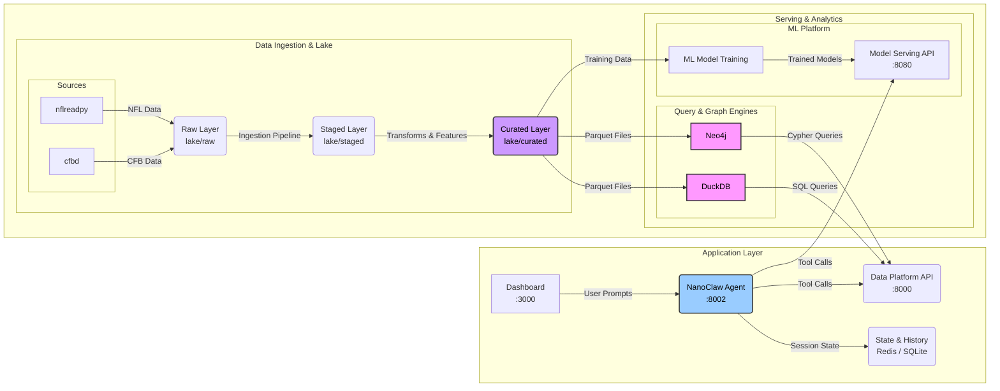

# NFL Agent Platform Architecture

```mermaid
graph LR
    subgraph AppLayer [Application Layer]
        direction TB
        M[Dashboard<br>:3000] -->|User Prompts| L(NanoClaw Agent<br>:8002)
        L -->|Session State| N(State & History<br>Redis / SQLite)
        L -->|Tool Calls| I(Data Platform API<br>:8000)
    end

    subgraph DataAndServing [ ]
        direction TB
        subgraph DataIngestion [Data Ingestion & Lake]
            direction TB
            subgraph Sources
                A[nflreadpy]
                A2[cfbd]
            end
            B(Raw Layer<br>lake/raw)
            D(Staged Layer<br>lake/staged)
            F(Curated Layer<br>lake/curated)
            A -- NFL Data --> B
            A2 -- CFB Data --> B
            B -- Ingestion Pipeline --> D
            D -- Transforms & Features --> F
        end

        subgraph ServingAnalytics [Serving & Analytics]
            direction TB
            subgraph QueryGraph [Query & Graph Engines]
                G[DuckDB]
                H[Neo4j]
            end
            subgraph MLPlatform [ML Platform]
                J[ML Model Training]
                K[Model Serving API<br>:8080]
            end
            F -- Parquet Files --> G
            F -- Parquet Files --> H
            F -- Training Data --> J
            J -- Trained Models --> K
        end
    end

    %% Cross-subgraph connections
    G -- SQL Queries --> I
    H -- Cypher Queries --> I
    L -- Tool Calls --> K

    %% Styling
    style F fill:#c9f,stroke:#333,stroke-width:2px,color:#000
    style G fill:#f9f,stroke:#333,stroke-width:2px,color:#000
    style H fill:#f9f,stroke:#333,stroke-width:2px,color:#000
    style L fill:#9cf,stroke:#333,stroke-width:2px,color:#000
```
